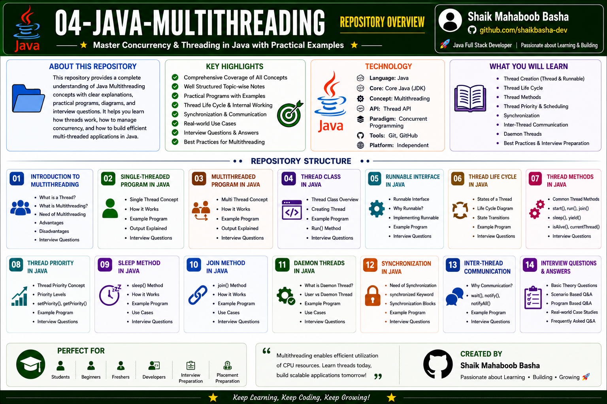

# Java Multithreading

## Overview

This repository contains comprehensive notes, examples, and interview preparation materials on **Multithreading in Java**.

The content is organized from basic to advanced concepts and includes:

* Introduction to Multithreading
* Single-Threaded Program
* Multithreaded Program
* Thread Class
* Runnable Interface
* Thread Life Cycle
* Thread Methods
* Thread Priority
* Sleep Method
* Join Method
* Daemon Threads
* Synchronization
* Inter-Thread Communication
* Multithreading Interview Questions and Answers

Each topic contains theory, examples, explanations, outputs, important points, pseudocode, and interview-oriented content to help learners build a strong understanding of Java Multithreading and concurrency.

## Repository Overview

## Repository Structure

### 01 - Introduction to Multithreading in Java

This section introduces threads, multithreading, and the importance of concurrent execution in Java applications.

Topics Covered:

* What is Multithreading
* Need for Multithreading
* Advantages of Multithreading
* Thread vs Process
* Thread Scheduler
* Real-world Examples
* Basic Programs

### 02 - Single-Threaded Program in Java

This section explains sequential program execution using a single thread.

Topics Covered:

* Introduction to Single Threading
* Sequential Execution
* Characteristics of Single-Threaded Programs
* Advantages and Limitations
* Example Programs
* Execution Flow

### 03 - Multithreaded Program in Java

This section explains concurrent execution using multiple threads.

Topics Covered:

* Introduction to Multithreaded Programs
* Concurrent Execution
* Benefits of Multithreading
* Thread Creation Basics
* Example Programs
* Practical Applications

### 04 - Thread Class in Java

This section explains thread creation and management using the Java Thread class.

Topics Covered:

* Thread Class Introduction
* Creating Threads by Extending Thread Class
* start() Method
* run() Method
* sleep()
* join()
* getName()
* setName()
* setPriority()
* Thread Life Cycle
* Example Programs

### 05 - Runnable Interface in Java

This section explains thread creation using the Runnable interface.

Topics Covered:

* Runnable Interface
* run() Method
* Implementing Runnable
* Runnable vs Thread
* Lambda Expression with Runnable
* Multiple Threads using Runnable
* Example Programs

### 06 - Thread Life Cycle in Java

This section explains the different states and transitions of a Java thread.

Topics Covered:

* New State
* Runnable State
* Running State
* Blocked State
* Waiting State
* Terminated State
* getState() Method
* Thread State Transitions
* Example Programs

### 07 - Thread Methods in Java

This section covers commonly used Java Thread methods and their purpose.

Topics Covered:

* start()
* run()
* sleep()
* join()
* yield()
* interrupt()
* isAlive()
* getName()
* setName()
* currentThread()
* getPriority()
* setPriority()
* getState()
* Example Programs

### 08 - Thread Priority in Java

This section explains thread priorities and their relationship with thread scheduling.

Topics Covered:

* Thread Priority
* MIN_PRIORITY
* NORM_PRIORITY
* MAX_PRIORITY
* setPriority()
* getPriority()
* Scheduler Behavior
* Priority Examples

### 09 - Sleep Method in Java

This section explains how to temporarily pause thread execution using the sleep() method.

Topics Covered:

* Thread.sleep()
* Delaying Thread Execution
* InterruptedException
* sleep() in Single Thread
* sleep() in Multiple Threads
* Timing Examples

### 10 - Join Method in Java

This section explains thread coordination using the join() method.

Topics Covered:

* join() Method
* Waiting for Thread Completion
* join() with Multiple Threads
* join() with sleep()
* Thread Coordination
* Example Programs

### 11 - Daemon Threads in Java

This section explains background threads and JVM behavior related to daemon threads.

Topics Covered:

* Daemon Thread Definition
* User Thread vs Daemon Thread
* setDaemon()
* isDaemon()
* JVM Shutdown Behavior
* Background Tasks
* Example Programs

### 12 - Synchronization in Java

This section explains synchronization, race conditions, and thread safety.

Topics Covered:

* Synchronization Concept
* Race Condition
* synchronized Keyword
* Synchronized Method
* Synchronized Block
* Static Synchronization
* Thread Safety
* Example Programs

### 13 - Inter-Thread Communication in Java

This section explains communication and coordination between Java threads.

Topics Covered:

* Inter-Thread Communication
* wait()
* notify()
* notifyAll()
* Producer Consumer Problem
* Shared Resources
* Thread Coordination
* Example Programs

### 14 - Multithreading Interview Questions and Answers in Java

This section contains interview-oriented questions covering important Java Multithreading and concurrency concepts.

Topics Covered:

* What is Multithreading
* Thread vs Runnable
* Thread Life Cycle
* Synchronization
* Race Condition
* wait() vs sleep()
* notify() vs notifyAll()
* Daemon Thread
* volatile vs synchronized
* Deadlock
* ExecutorService
* Producer Consumer Problem
* Frequently Asked Interview Questions

## Features of This Repository

This repository provides:

* Beginner to advanced Multithreading concepts
* Well-structured learning path
* Detailed theory notes
* Java programs with explanations
* Output for every program
* Pseudocode and flow explanations
* Thread creation techniques
* Thread life cycle and internal working concepts
* Synchronization and thread safety
* Inter-thread communication
* Real-world examples
* Interview questions and answers
* Suitable for revision and technical interviews

## Technologies Used

* Java
* Multithreading
* Thread API
* Runnable Interface
* Synchronization
* Git
* GitHub
* Markdown

## Interview Preparation

Interview questions and answers cover:

* Multithreading Fundamentals
* Thread vs Process
* Thread Class
* Runnable Interface
* Thread Life Cycle
* Thread Methods
* Thread Priority
* sleep() and join()
* Daemon Threads
* Synchronization
* Race Conditions
* wait(), notify(), and notifyAll()
* Deadlock
* ExecutorService
* Producer Consumer Problem

The interview preparation content is structured to strengthen concurrency concepts and support Java technical interview preparation.

## Purpose

This repository is created to:

* Build strong Multithreading concepts in Java
* Understand thread creation and management
* Learn concurrent execution concepts
* Understand thread life cycle and scheduling
* Learn synchronization and thread safety
* Understand inter-thread communication
* Practice Multithreading through Java programs
* Prepare for Java technical interviews
* Maintain structured Java learning notes
* Support quick revision and placement preparation

## Repository Highlights

* 14 structured Multithreading sections
* Theory, programs, and output
* Pseudocode and flow explanations
* Thread creation using Thread and Runnable
* Thread life cycle and scheduling
* Synchronization and race conditions
* wait(), notify(), and notifyAll()
* Producer Consumer Problem
* Daemon Threads
* Interview questions and answers
* Beginner-friendly learning structure
* Interview-oriented content

## Who Can Use This Repository

This repository is useful for:

* Beginners learning Java Multithreading
* Java students
* College students
* Freshers preparing for technical interviews
* Placement preparation
* Java interview preparation
* Developers revising Multithreading and concurrency concepts

## Author

**Shaik Mahaboob Basha**

B.Tech - Electronics and Communication Engineering

Aspiring Java Full Stack Developer

## Future Improvements

Additional advanced topics may include:

* ExecutorService Deep Dive
* Callable and Future
* Thread Pool Executor
* Fork Join Framework
* CompletableFuture
* ConcurrentHashMap Deep Dive
* Atomic Classes
* ReentrantLock
* CountDownLatch
* CyclicBarrier

## Support

If this repository helps you in your learning journey, interview preparation, or future reference, please consider giving it a **Star ⭐**. Your support is greatly appreciated and motivates me to continue creating high-quality educational repositories.

## Conclusion

This repository is created as a comprehensive Java Multithreading learning and interview preparation resource. It contains thread and concurrency concepts, practical programs, detailed explanations, synchronization techniques, inter-thread communication, real-world examples, and interview questions arranged in a structured manner for easy learning, revision, and technical interview preparation.

Happy Learning and Keep Coding!
